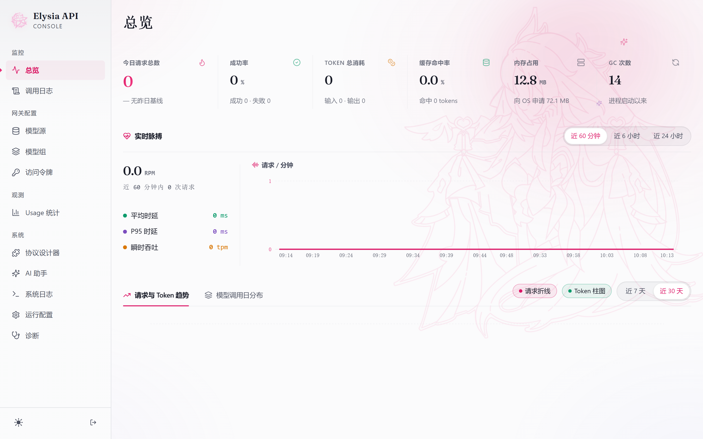
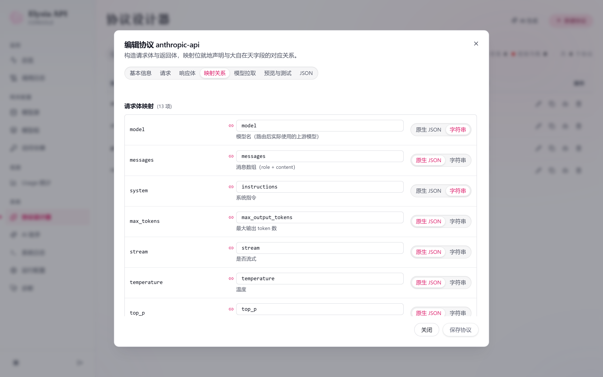
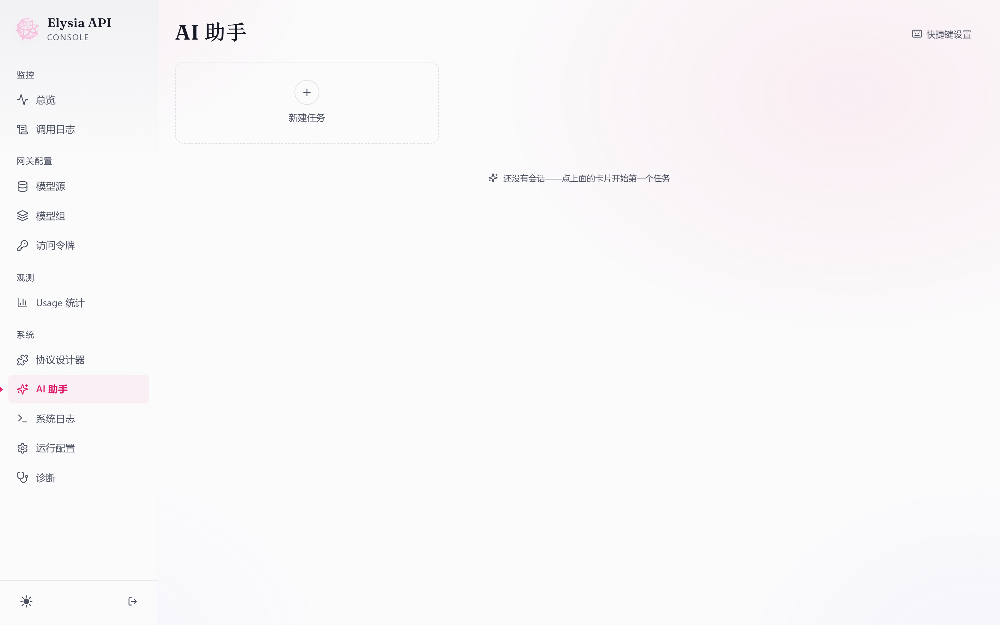
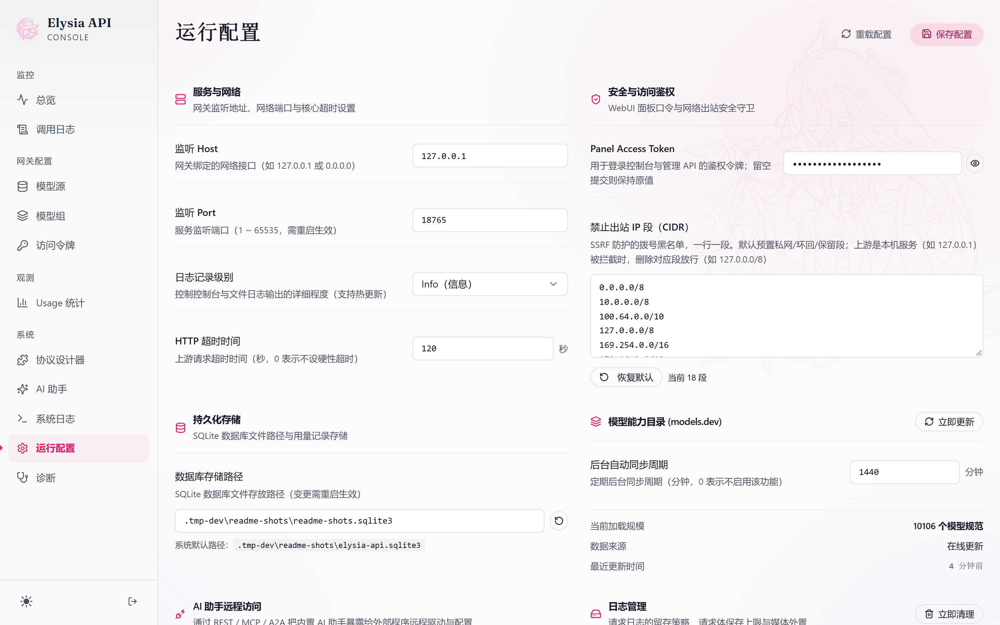

<div align="center">
  <p></p>
  <p><strong>轻量、自部署的 AI 网关。</strong><br>
    统一模型接入、协议转换与 AI 运维。</p>
  <p>
    <a href="https://github.com/PinkElysiaDev/Elysia-Api/releases/latest"></a>
    <a href="https://github.com/PinkElysiaDev/Elysia-Api/stargazers"></a>
    <a href="backend/go.mod"></a>
    <a href="LICENSE"></a>
  </p>
  <p><a href="#快速开始"><strong>快速开始</strong></a> · <a href="#界面预览">界面预览</a> · <a href="docs/README.md">完整文档</a> · <a href="CHANGELOG.md">更新日志</a><br>
    <strong>简体中文</strong> · <a href="README.en.md">English</a></p>
</div>

## 特性

- 多协议兼容：支持 OpenAI Chat Completions / Responses、Anthropic Messages、Gemini GenerateContent，流式转换与同协议透传
- 流量调度：模型组负载均衡、多 Key 调度、并发/配额限制、Key 权限自动探测
- 无代码扩展：可视化字段映射自定义上游协议，保存后生效，无需修改源码
- AI 运维：内置管控助手，支持协议自动接入、用量分析、故障排查，写操作按会话权限审批
- 多端管控：内嵌 WebUI，提供 REST / MCP / A2A 远程管控，CLI 命令由 Agent 工具执行
- 安全加固：主密钥加载成功时加密存储敏感字段、出站 IP 策略、用量与请求日志

> 完整能力、实现原理见 [文档目录](docs/README.md)

## 界面预览

| 总览                                     | 协议设计器                                            |
|:--------------------------------------:|:------------------------------------------------:|
|  |  |
| AI 助手                                  | 运行配置                                             |
|   |           |

[登录页动效](packages/webui/public/assets/elysia-login.mp4)

## 快速开始

### 1. 下载

从 [GitHub Releases](https://github.com/PinkElysiaDev/Elysia-Api/releases/latest) 下载对应平台预编译产物，附 SHA256 校验文件。

<summary>平台对应产物</summary>

| 平台                  | 文件名                             |
| ------------------- | ------------------------------- |
| Windows amd64/arm64 | `elysia-api-windows-{arch}.exe` |
| Linux amd64/arm64   | `elysia-api-linux-{arch}`       |
| macOS 通用            | `elysia-api-macos.dmg`          |

### 2. 启动

首次启动自动生成配置与 SQLite 数据库。Windows / Linux 的启动日志会输出随机面板令牌；默认监听 `127.0.0.1:8765`。端口被占用时需修改配置，macOS App 会自动寻找可用端口。

<details>
<summary><strong>Windows</strong></summary>

直接双击对应架构 exe 启动，或命令行执行：

```powershell
.\elysia-api-windows-amd64.exe
```

ARM64 使用 `elysia-api-windows-arm64.exe`。配置默认生成于当前工作目录。

</details>

<details>
<summary><strong>Linux</strong></summary>

```bash
chmod +x ./elysia-api-linux-amd64
./elysia-api-linux-amd64
```

ARM64 将两处文件名替换为 `elysia-api-linux-arm64`。

</details>

<details>
<summary><strong>macOS</strong></summary>

1. 挂载 DMG，将 ElysiaApi 拖入应用目录（支持 macOS 12+，双架构通用）
2. 面板令牌可从菜单栏复制，数据存储于 `~/Library/Application Support/ElysiaApi/`
3. 如遇 Gatekeeper 拦截，执行后重试：

   ```bash
   xattr -d com.apple.quarantine /Applications/ElysiaApi.app
   ```

</details>

<details>
<summary><strong>Docker</strong></summary>

```bash
# 在仓库根目录构建本地镜像
docker build -t elysia-api:local .
# 启动服务
docker run -d --name elysia-api \
  -p 127.0.0.1:8765:8765 \
  -v elysia-data:/data \
  -e ELYSIA_API_HOST=0.0.0.0 \
  elysia-api:local
```

执行 `docker logs elysia-api` 获取初始面板令牌；生产环境安全加固、Compose 模板见[部署文档](docs/deployment.md)。

</details>

### 3. 接入模型

1. 访问 `http://127.0.0.1:8765/ui/`，使用面板令牌登录；macOS App 以菜单栏地址为准，下方调用地址也需使用该端口

2. 添加「模型源」，填写上游地址与 API Key，拉取模型列表

3. 创建名为 `default` 的「模型组」，加入可用模型

4. 创建对应权限的 Relay API Token（推理令牌），发起测试：

   ```bash
   curl http://127.0.0.1:8765/v1/chat/completions \
   -H "Authorization: Bearer <RELAY_TOKEN>" \
   -H "Content-Type: application/json" \
   -d '{"model":"default","messages":[{"role":"user","content":"hi"}]}'
   ```

   返回 JSON 中的 `choices[0].message.content` 即为模型回复。401 检查推理令牌；无可用模型时检查源、组成员及启停状态。

   > 面板令牌用于管理；推理令牌用于 `/v1` 和 `/v1beta`；带 `agent` 作用域的 Key 用于远程运维。详见[鉴权说明](docs/remote-agent-api.md#鉴权)。

## 配置

`config.json` 保存监听地址、数据库路径和运行策略；模型源、模型组、访问令牌及用量记录存储于 SQLite。
通常无需手工创建配置。以下为最小手工配置；省略 `httpTimeout` 表示不限时，首次自动生成的配置写入 120 秒。手工配置必须将 `change-me` 替换为随机面板令牌：

```json
{
  "host": "127.0.0.1",
  "port": 8765,
  "panelAccessToken": "change-me",
  "databasePath": "elysia-api.sqlite3"
}
```

> 全量配置项、环境变量、旧版本迁移、备份恢复、安全加固见 [部署文档](docs/deployment.md)。

## 进阶文档

- [自定义协议开发](docs/protocol-definition-reference.md)
- [AI Agent 远程接入](docs/remote-agent-api.md)
- [运维与接口参考](docs/webui-api.md)
- [CLI 命令手册](docs/agent-cli.md)

## 构建

依赖：Node.js 22+、Go 1.25+

```bash
npm install && npm run build
```

产物输出至 `dist/standalone/`，DMG 打包、交叉编译等完整构建说明见[开发指南](docs/development.md)。

## 贡献

Issue 请附环境、复现步骤与脱敏日志；PR 请说明变更与验证方式，行为变更同步更新文档。

## 许可

见 [LICENSE](LICENSE)。
